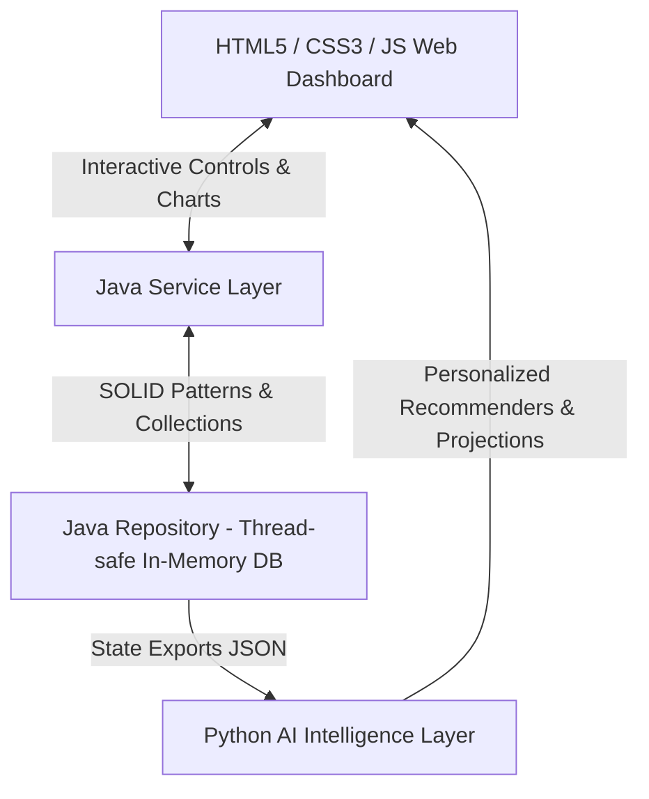

# SmartLib AI — Next-Generation Enterprise Library System

Welcome to **SmartLib AI**, a premier, highly-decoupled multi-language showcase project engineered for software engineering portfolios. It demonstrates a production-grade orchestration of **concurrent enterprise systems**, **machine learning intelligence**, and **responsive interactive design**.

---

## 🏗️ System Architecture & Orchestration

SmartLib AI is architected in three completely decoupled service layers:



### 1. Java Core Backend (`/backend/`)
* **Thread-Safe Concurrency**: Uses java Concurrent Collections (`ConcurrentHashMap`, `CopyOnWriteArrayList`) to ensure collision-free transactions during multi-threaded checkout/return simulator routines.
* **Smart Waitlist Priority Queues**: Out-of-stock items auto-register requests inside a bounded priority queue sorted by member classifications (Premium/VIP levels vs standard accounts) rather than simple FIFO ordering.
* **SOLID Architecture**: Structured cleanly across Entity Models, Repositories, and Business Logic Services.

### 2. Python AI Intelligence Layer (`/ai_intelligence/`)
* **Cognitive Recommender (`recommender.py`)**: Features a hybrid content-based vector affinity model and user-collaborative filtering utilizing the Jaccard Similarity Index to suggest next-reads.
* **Heuristic Lexical NLP Analyzer (`sentiment.py`)**: Performs natural language review analysis, mapping member review vocabularies to specialized lexicons to extract score indices (-1.0 to 1.0).
* **Predictive Inventory Forecaster (`forecaster.py`)**: Utilizes linear borrowing velocity extrapolation to calculate critical stockout risk matrices and recommended replenishment cycles.
* **Intelligence Agent (`ai_agent.py`)**: Binds all three custom AI algorithms into a single orchestration routine, feeding aggregated analytical insights directly into the web dashboard.

### 3. Glassmorphic Web Dashboard (`/dashboard/`)
* **Visual Premium Theme**: A gorgeous, responsive glassmorphic design featuring slate-blue color harmonies matching the flagship developer portfolio.
* **Dynamic Data Rendering**: Fetches backend reports via AJAX, with a built-in silent offline cache fallback enabling 100% interactive operation when running via `file://` protocol.
* **Chart.js Projections**: Renders interactive, gorgeous bar charts visualizing predictive inventory borrow velocities.

---

## 🚀 Execution & Demonstration Manual

### Phase 1: Fire Up the Java Enterprise Core
Compile and bootstrap the Java simulation engine:
```bash
# Navigate to the workspace root
cd c:\Users\sande\OneDrive\Desktop\bunny\java\lyb

# Compile the SOLID core layers
javac backend/*.java

# Boot the simulation engine
java backend.MainApp
```
*Java writes `summary.json`, `catalog.json`, and `transactions.json` into `/dashboard/` assets.*

### Phase 2: Compute AI Machine Learning Indexes
Execute the cognitive python orchestrator:
```bash
# Run the pipeline engine
python ai_intelligence/ai_agent.py
```
*Python parses backend records and outputs the compiled `reports.json` dashboard payload.*

### Phase 3: Launch the Slate-Blue Glassmorphic Dashboard
Simply open `/dashboard/index.html` in any modern web browser to interact with the responsive panels, toggle selected profiles, and fire off processing simulations!

---

## 🎨 Design Aesthetics & Visual Highlights
- **White-Glassmorphic Cards**: Features blur filters, glowing border indicators, and fine-line geometry.
- **Dynamic Interactive States**: Includes responsive hover scaling, hover gradients, and custom select dropdowns.
- **Micro-Animations**: Features custom pulse animations on connection headers and fade-in entries.
- **Robust Fail-Safes**: Implements complete data fallback blocks to bypass CORS constraints, making it fully testable directly inside offline portfolio folders!
